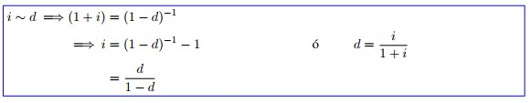

--- 
title: "Matemáticas Financieras"
author: "Eduardo Selim Martinez Mayorga"
date: "`r Sys.Date()`"
site: bookdown::bookdown_site
documentclass: book
bibliography: [book.bib, packages.bib]
# url: your book url like https://bookdown.org/yihui/bookdown
# cover-image: path to the social sharing image like images/cover.jpg
description: |
  Estas son notas creadas para el apoyo del curso de matemáticas financieras
link-citations: yes
github-repo: rstudio/bookdown-demo
---

# Teoría del interés

::: {.definition name="Definición de Interés"} 
El interés se puede definir como una compensación/beneficio que una parte A le da a una parte B por dejar de satisfacer una necesidad para que el otro satisfaga la propia.
:::

Solo pensando en términos monetarios... ¿Por qué las inversiones (en teoría ) crecen?
Algunos factores que intervienen en una inversión:

- Dinero (¿cuánto tiempo?)
- ¿En qué se invierte?
- ¿Cuánto tiempo lo invierto?
- Inflación
- Bajo que condiciones contractuales lo invierto (¿cómo crece el dinero ?)
- Oferta y demanda
- ¿Cuándo lo invierto?

Por un momento(grande) pensemos que el nivel de inversión depende solo del tiempo.

::: {.theorem}
Se dice que una función $a:\left[ 0,\infty \right) \longrightarrow \mathbb{R}$ es una función de acumulación si cumple:

1. $a(0) = 1$
2. $a\left(\cdot\right)$ es no-decreciente
3. $a(\cdot)$ es continua por la derecha y con límite por la izquierda.

$a(t)$ representa el valor acumulado de $\$1$ que hay durante un lapso de tiempo t.
:::

::: {.example}
.

1. $a(t) = 1+ct$, $c>0$, $c$ constante (interés simple)

2. $a(t) = e^{\alpha t}$, $\alpha > 0$ (interés compuesto)

3. $a(t) = ct^2 + 1$, $c>0$

4. $a(t) = 1$

5. $a(t) = (1+t)^c$, $c>0

6. $a(t) = 1 + arctang(t)$

7. $a(t) = \sqrt{t+1}$

8. $a(t) = \sqrt{t} + 1$

9. $a(t) = 1 + c\left[ t \right]$

10. $a(t) = e^{\left[ t \right]}$
:::

::: {.definition}
Se define la **función de monto** correspondiente a $a(t)$ como un capital inicial $k>0$, como 
$$ A_k \left( t \right) : = k \cdot a \left( t\right)$$
:::

::: {.remark}
Se cumple (1) y (3), pero $A_k(0) = k \cdot a(0) = k \cdot 1 = k$
:::

$A_k(t)$ representa el valor acumulado de una inversión de un lapso de tiempo t.

**Representación gráfica**

¿Cómo medimos el performance de una función de acumulación o función de monto?

Estudiaremos 3 indicadores:

1. Tasa efectiva de interés al tiempo t
2. Tasa de descuento al tiempo t
3. Fuerza de interés

::: {.definition}
Para una función de acumulación $a\left( \cdot \right)$ se define la tasa efectiva de \underline{\textbf{interés al tiempo t}} como:
$$ i_t := \frac{a\left( t \right) - a\left( t -1 \right)}{a\left( t - 1 \right)}$$
:::

**Interpretación:** Por cada peso invertida al tiempo $t-1$ hay $i_t$ unidades de ganancia. "Lo que yo gané por cada peso que invertí".

::: {.example}
.

1. Para $a(t) = 1 + ct$
$i_t = \frac{a\left( t \right) - a\left( t -1 \right)}{a\left( t - 1 \right)} = \frac{1 + ct - \left[ 1 + c(t-1)\right] }{1+c(t-1)} = \frac{c}{1+c(t-1)}$
Obsérvese que la aplicación $t \longmapsto i_t = \frac{c}{1+c(t-1)}$ es **decreciente**.
Con la función $a(t) = 1 + ct$ ganamos, pero cada vez menos conforme el tiempo avanza.

2. Para $a(t) = e^{\alpha t}$, $\alpha > 0$
$i_t = \frac{a\left( t \right) - a\left( t -1 \right)}{a\left( t - 1 \right)} = \frac{e^{\alpha t} - e^{\alpha (t-1)}}{e^{\alpha (t-1)}} = \frac{e^{\alpha (t-1)}\left[ e^{\alpha}-1\right]}{e^{\alpha (t-1)}} = e^{\alpha} -1$
Obsérvese que la aplicación $t \longmapsto i_t = e^{\alpha} -1$ es **constante**.

tarea

Para $a(t)= e^{t^2}$ calcular $i_t$ y ver si $t \longmapsto i_t$ es creciente o decreciente

3. $a(t) = (1+c)^t$, $c > 0$
$i_t =  \frac{a\left( t \right) - a\left( t -1 \right)}{a\left( t - 1 \right)} = \frac{(1+c)^t - (1+c)^{t-1}}{(1+c)^{t-1}} = \frac{(1+c)^{t-1}[(1+c)-1]}{(1+c)^{t-1}} = 1+c-1 = c$
Obsérvese que la aplicación $t \longmapsto i_t = e^{\alpha} -1$ es **constante**.
:::

::: {.remark}
Los ejemplos 2 y 3 son los mismos 
$(1+c)^t=e^{log\left((1+c)^t \right)} = e^{tlog(1+c)}=e^{\alpha t}$, con $\alpha = log(1+c)$.

En el mundo financiero preferimos escribir a la función exponencial como $(1+c)^t$.
:::

**Notación**

En realidad preferimos escribir a la función exponencial como $a(t) = (1+i)^t$. Bajo esta notación $i_t = c = i$, es decir, $i_t=i$.

Al número "$i$"  le llamamos tasa efectiva de interés, y al modelo $a(t)=(1+i)^t$ se le conoce como el modelo de interés compuesto..

:::{.remark}
$\frac{A_k(t)-A_k(t-1)}{A_k(t-1)}=\frac{ka(t) - ka(t-1)}{ka(t-1)} = \frac{a(t)-a(t-1)}{a(t-1)} = i_t$
:::

::: {.definition}
Para una función de acumulación $a(t)$ diferenciable, se define la \underline{\textcolor{blue}{fuerza de interés}} correspondiente a $a(\cdot)$ como 
:::
\begin{equation*}
\boxed{
\delta_t : = \frac{\frac{\partial}{\partial t} a(t)}{a(t)}
}\end{equation*}

¿De dónde viene esa definición?

::: {.remark}

$\delta_t$ también se puede obtener como $\frac{\partial}{\partial t} log(a(t)) = \frac{a'(t)}{a(t)} = \delta_t$

:::

::: {.example}
.

1. $a(t)=e^{\alpha t}$

$\delta_t = \frac{a'(t)}{a(t)} = \frac{\left( e^{\alpha t}\right)'}{e^{\alpha t}} = \frac{\alpha e^{\alpha t}}{e^{\alpha t}} = \alpha$

$\therefore \delta_t = \alpha$, con $\alpha$ constante

2. $a(t) = 1+ct$

$\delta_t = \frac{a'(t)}{a(t)} = \frac{\left( 1+ct\right)'}{1+ct} = \frac{c}{1+ct}$ 

$\therefore t\longmapsto \delta_t$ es decreciente

:::

::: {.definition}
Para una función de acumulación $a(\cdot )$ se define la tasa efectiva de descuento al tiempo t como:
\begin{equation*}
\boxed{d_t := \frac{a(t)-a(t-1)}{a(t)}}
\end{equation*} 
:::

También se conoce como tasa efectiva de descuento en el intervalo $\left[ t-1, t\right]$. ¿Cómo se interpreta $d_t$?

Por cada unidad de $a(t)$ hay $d_t$ unidades de $a(t)-a(t-1)$. "Por cada peso obtenido hay $d_t$ pesos de ganancia obtenida".

::: {.example}
.

1. $a(t) = (1+i)^t$

$d_t = \frac{a(t) - a(t-1)}{a(t)} = \frac{(1+i)^t - (1+i)^{t-1}}{(1+i)^t} = 1 - (1+i)^{-1} = \frac{1+i-1}{1+i} = \frac{i}{1+i} = c$

donde $c$ es una constante

2. $a(t) = 1+it$

$d_t = \frac{a(t) - a(t-1)}{a(t)} = \frac{1 + it - (1 + i(t - 1))}{i + it} = \frac{i}{1 + it}$
:::

::: {.remark}
La aplicación $t \longmapsto d_t = \frac{i}{1 + it}$ es **decreciente**.
:::

1)  Supongamos que un banco le ofrece darte un porcentaje $c$ por cada cada peso invertido al final de cada periodo, **sin** posibilidad de reinvertir las ganancias.

¿Cuánto dinero tendré al final de $n$ periodos? Supongamos que hoy invertimos $K$.

  $\longrightarrow$ ¿Cuánto dinero tendré al final de 1 periodo?
\[  \underbrace{K}_{\text{Inicial}} + \underbrace{Kc}_{\text{Ganancia}} = K(1+c)\]

  $\longrightarrow$ ¿Cuánto dinero tendrá al final de 2 periodos?
\[ \underbrace{K(1+c)}_{\text{Ya lo tenía}} + \underbrace{Kc}_{\text{Ganancia}} = K(1+2c)\]

Inductivamente, el dinero al final de $n$ periodos es $K(1+n\cdot c)$, $n\in \mathbb{N}_+$.

2) Ahora, con la posibilidad de reinvertir las ganancias:

Supóngase que un banco le ofrece darle un porcentaje por cada peso invertido al final de cada periodo **con** posibilidad de reinvertir las ganancias.

  $\longrightarrow$  ¿Cuánto dinero tendré al final de 2 periodos?
\[ \underbrace{K(1+c)}_{\text{Ya lo tenía}} + \underbrace{K(1+c)\cdot c}_{\text{Ganancia}} = K(1+c)(1+c) = K(1+c)^2\]

  $\longrightarrow$ ¿Cuánto dinero tendré al final de 3 periodos?
\[ \underbrace{K(1+c)^2}_{\text{Ya lo tenía}} + \underbrace{[K(1+c)^2]c}_{\text{Ganancia}} = K(1+c)^2(1+c) = K(1+c)^3\]

Inductivamente el dinero al final de $n$ periodos es $k(1+c)^n$, $n\in \mathbb{N}_+$.

  $\longrightarrow$ A 1. se le conoce como la **génesis económica del interés simple**, $a(n) = 1+cn$, y nos gusta escribirla como $a(n) = 1+in$, donde a $i$ se le llama tasa efectiva de interés simple.
  
  $\longrightarrow$ A 2. se le conoce como **génesis económica del interés compuesto**, $a(n) = (1+c)^n$, y nos gusta escribirla como $a(n) = (1+i)^n$, donde a $i$ se le conoce como tasa efectiva de interés.

::: {.definition}
Se dice que una función de acumulación $a(\cdot )$ es un **modelo de interés simple** si cumple las siguientes características:

1. $a(1) = 1+ i$, para $i$ constante

2. $a(\cdot)$ es diferenciable

3. $\forall s,t \in \left[0,\infty \right) \quad a(t+s)+1 = a(t) + a(s) \ldots (Ü)$
:::

::: {.proposition}
Si $a(\cdot)$ es una función de acumulación que es un modelo de interés simple, entonces $a(t) = 1 + it \quad \forall t\in \left[0,\infty \right)$
:::

::: {.proof}
\begin{align*}
a'(u) &= \lim\limits_{h \to 0} \frac{a(u+h)-a(u)}{h} \longleftarrow \, \text{Existe por (2)} \\
&\stackrel{(Ü)}{=} \lim\limits_{h \to 0} \frac{\left(a(u)+a(h)-1 \right) - a(u)}{h}\\
&= \lim\limits_{h \to 0} \frac{a(h)-1}{h}\\
&= \lim\limits_{h \to 0} \frac{a(h)-a(0)}{h}\, \text{, pues} \, a(\cdot) \, \text{es función de acumulación}\\
&= a'(0) = \text{cte} \, \text{con respecto a t.}
\end{align*}

Es decir, $a'(u) = a'(0)\Longrightarrow \int_{0}^{t}a'(u)\,du = \int_{0}^{t}a'(0)\,du$
\begin{align*}
&\stackrel{TFC}{\Longrightarrow} a(t) - a(0) = a'(0)\cdot t\\
&\Longrightarrow a(t) - 1 = a'(0)\cdot t\\
&\Longrightarrow a(t) = 1 + a'(0)t \ldots (*)\\
\text{Pero por (1)} \, &\Longrightarrow a(1) = 1+i = 1 + a'(0)\cdot 1\\
& \Longrightarrow a'(0) = i
\end{align*}
Sustituimos en $(*)$
$$\therefore \, a(t) = 1+it$$
:::

::: {.definition}
Se dice que una función de acumulación $a(\cdot)$ es un **modelo de interés compuesto** si cumple las siguientes características:

(1) $a(1) = 1+i$, para $i$ constante

(2) $a(\cdot)$ es diferenciable  

(3) $\forall s,t \in \left[0,\infty \right) \quad a(t+s)= a(t)\cdot a(s) \ldots (\ddot\smile)$
:::

::: {.proposition}
Si $a(\cdot)$ es una función de acumulación que es un modelo de interés compuesto, entonces $a(t) = (1+i)^t \quad \forall t\in \left[0,\infty \right)$
:::

::: {.proof}
\begin{align*}
a'(u) &= \lim\limits_{h \to 0} \frac{a(u+h)-a(u)}{h} \longleftarrow \, \text{Existe por (2)} \\
&\stackrel{(\ddot\smile)}{=} \lim\limits_{h \to 0} \frac{a(u)\cdot a(h) - a(u)}{h}\\
&=  a(u) \cdot \lim\limits_{h \to 0} \frac{a(h)-1}{h}\\
&=  a(u) \cdot \lim\limits_{h \to 0} \frac{a(h)-a(0)}{h}\, \text{, pues} \, a(\cdot) \, \text{es función de acumulación}\\
&= a(u)\cdot a'(0)
\end{align*}
\[\therefore \, a'(u) = a(u) \cdot a'(0) \Longrightarrow \frac{a'(u)}{a(u)} = a'(0)\]

$$\Longrightarrow \int_{0}^{t}\frac{a'(u)}{a(u)}\, du = \int_{0}^{t} a'(0)\, du \Longrightarrow \int_{0}^{t} \frac{\partial}{\partial t} log(a(u)) \, du = a'(0)t$$
\begin{align*}
&\stackrel{\text{TFC}}{\Longrightarrow} log(a(t)) - log(a(0)) = a'(0)t\\
&\Longrightarrow log(a(t)) - log(1) = log(a(t)) - 0 = a'(0)t\\
&\Longrightarrow a(t) = exp\{a'(0)t\} \ldots (°)
\end{align*}
Pero por (1), $a(1) = 1+i$

Sustituimos en (°) 

\begin{align*}
&1+i = exp\{a'(0)\cdot 1\} \\
&\Longrightarrow log(1+i) = a'(0) \ldots (\#)\\
&\text{Sustituyendo}\,(\#)\, \text{en} \, (°)\\
& \Longrightarrow a(t) = exp\{log(1+i)\cdot t\}\\
& \Longrightarrow a(t) = exp\{log(1+i)^t\}\\
& \therefore \, a(t) = (1+i)^t
\end{align*}
:::

## Ayudantía

$\frac{d}{dt}(1+i)^t = \frac{d}{dt} \left(e^{t\log(1+i)} \right)= e^{t\log(1+i)}\left(\log(1+i)\right) =\underline{(1+i)^t\left( \log(1+i)\right)}$

::: {.theorem name="Teorema de Taylor"}
Sea $f$ una función, supongamos que existen $f', \, \ldots \, f^{(n+1)}$ en $[a,x], \, a\in\mathbb{R}$. Sea $n\in\mathbb{N}$, se define como:
$$f(x) = \frac{f(a)}{0!}+\frac{f'(a)}{1!}(x-a)+\frac{f''(a)}{2!}(x-a)^2 + \, \ldots \, + \frac{f^{(n)}(a)}{n!}(x-a)^n + R_{n, a(x)}$$
Entonces $R_{n, a(x)} = \frac{f^{(n+1)}(a)}{(n+1)!}(x-a)^n$ y si $f$ es integrable
$R_{n, a(x)} = \int\frac{f^{(n+1)}(t)}{(n+1)!}(x-t)^n\, dt$.
:::

::: {.remark}
\begin{align*}
&\int v^t \, dt = 1 \cdot \int v^t \, dt = \frac{\log (v)}{\log (v)}\int v^t \, dt & u = v^t \quad du = v^t \log(v)\\
&\Longrightarrow \frac{1}{\log (v)}\int v^t\log(v) \, dt =\frac{v^t}{\log(v)} + C & \Longrightarrow \int du = \int v^t \log(u) = v^t
\end{align*}

En general: 
\begin{align*}
& \int u'\cdot e^{u}\, du = e^{u} + C \\
& \int u'a^{u} \, du = \frac{a^{u}}{\log(a)} + C 
\end{align*}
:::

### Ejercicios (interés simple)

1. ¿Cuánto interés se gana en el cuarto año si se invierten $\$ 3000$ bajo interés simple a una tasa anual del $5\%$ ¿Cuál es el saldo al final del cuarto año?

Saldo final:

$A(t) = 3,000(1+0.05(4)) = \underline{3,600}$

2. ¿En cuántos años se acumularán $\$500$ a $\$800$ con un interés del $6\%$?

$A(1) = 500, \: A(t) = 800, \: i = 6\% \\ 
A(t) = 500 (1 + 0.06(t)) = 800\\ 
\frac{800}{500} = 1+ 0.06 (t) \: \Longrightarrow \: \frac{8}{5}-1 = 0.06(t) \: \Longrightarrow \: \frac{\frac{8}{5}-1}{0.06} = t \quad  \therefore\underline{\: t = 10 \, \text{años}}$

3. Encuentre la tasa de interés simple anual para que $\$ 1,000$ invertido a tiempo $t = 0$ crezca a $\$1,700$ en 8 años.

$A(0) = 1,000, \: A(8) = 1,700, \: t=8 \, \text{años}\\A(8) = 1,000(1+i(8)) = 1,700 \: \Longrightarrow \: \frac{1,700}{1,000} = (1+i(8))\\ 
\Longrightarrow \: \frac{(1.7-1)}{8} = i = 0.087\\
\therefore \: \underline{\text{La tasa anual debe ser de } 8.7\%}$

4. A una tasa de interés simple, $\$ 1,200$ invertidos en el tiempo $t = 0$ acumula $\$1,320$ en $t$ años. Encuentre el valor acumulado de $\$500$ invertido a la misma tasa de interés simple y a $t = 0$, pero esta vez para $2t$

$A(0) = 1,200, \: A(t) = 1,320$

  a) $A(t) = 1200(1+it) = 1320 \: \Longrightarrow \: t = \frac{\frac{1320}{1200}-1}{i}$
  
  b) $A(2t) = 500(1+i2t)\\ 500\left( 1+\underline{i}2\left( \frac{\frac{1320}{1200}-1}{\underline{i}}\right) \right) = 500 \left( 1 + 2 \left( \frac{1320}{1200} -1\right) \right) = \underline{600\, \text{acum}}$

### Ejercicios (interés compuesto)

1. Alice invierte $\$2,200$, Su inversión crece de acuerdo al interés compuesto con una tasa de interés anual de $4\%$ por $t$ años en el cual acumuló $\$8,000$. Encuentre $t$.

$A(0) = 2,200,\: i=4\%,\: A(t) = \$ 8,000 \\ A(t) = 2,200(1+0.04)^t = 8,000 \: \Longrightarrow \: (1+0.04)^t = \frac{8,000}{2,200} \\ \Longrightarrow \: t\ln(1+0.04) = \ln\left( \frac{8,000}{2,200}\right) \\ \Longrightarrow t =\frac{\ln\left(\frac{8,000}{2,200} \right) }{\ln(1.04)} \\ \therefore \: \underline{t=32.91}$

2. Eliot recibe la herencia de su tía Ruth, cuando ella murió en su cumpleaños número 5. En su cumpleaños 18, la herencia creció a $\$ 32,168$. Si el dinero ha estado creciendo a una tasa de interés compuesto anual de $6.2\%$ encuentre la cantidad que le heredó la tía Ruth a Eliot.

$A(0) = M,\: i = 6.2\%,\: A(13) = 32,168\\ A(0) = M(1.062)^{13} = 32,168 \: \Longrightarrow \: M\frac{32,168}{(1.062)^{13}} = \underline{14,716.52}$

3. ¿Cuánto interés se gana en el cuarto año de una inversión de $\$1,000$ invertida a una tasa compuesta anual efectiva de $5\%$ ?

$t = 4\, \text{años}, \: M=1,000,\: i = 5\% \\ A(4) = 1,000(1+0.05)^4 = 1,215.5 \: \Longrightarrow \: 1,215.5 - 1,000 = 215.5\\ \therefore \: \underline{\text{El interés ganado es} \, \$ 215.5}$

4. A una cierta tasa de interés compuesta, el dinero se duplicará en $\alpha$ años, se triplicará en $\beta$ años y se multiplicará por 10 en $\gamma$ años. Al mismo tiempo con una tasa de interés compuesta, $\$5$ incrementa a $\$12$ en $n$ años. Encuentre el interés $a$, $b$, $c$ tal que $n=a\alpha + b\beta + c\gamma$
\begin{align*}
& A(\alpha) = M(1 + i)^{\alpha} = 2M  & \hfill \hfill \\
& A(\beta) = M(1+i)^{\beta} = 3M  & \textbf{Tarea} \, A(n) = 5 (1+i)^n = 12 \\
& A(\gamma) = M(1+i)^{\gamma} = 10M
\end{align*}

5. Eduardo depositó $\$ 826$ en una cuenta de ahorros que genera intereses a una tasa de incremento del banco. Durante los primeros $3$ años del depósito la tasa de interés anual es del $2.6\%$. Para los próximos $2$ años la tasa efectiva anual es del $4.5\%$ y los siguientes $5$ años la tasa de interés efectiva anual es del $6\%$, ¿Cuál es el acumulado al final de $10$ años?

 

\begin{align*}
A(10) &= 826 (1+i)^{10} \\
      &= 826 (1+0.026)^3(1+0.04)^2(1+0.06)^5 = \underline{1,303.71}\\
\hfill \text{ó} \\
A(3) &= 826(1+0.026)^3=X\\
A(5) &=X(1+0.04)^2 = Y\\
\therefore \: A(10) &=Y(1+0.06)^5
\end{align*}

## Clase

**Resumen**

::: {.example}

$a(t) = (1-d)^{-t}$, $t\geq 0$, $d\in (0,1)$

¿Es función de acumulación?

i) $a(0) = (1-d)^{-0} = 1$

ii) $a(\cdot)$ continua

iii) $a'(t) = \left( (1-d)^{-t}\right)' = \left( e^{-tlog(1-d)}\right)'
= e^{-tlog(1-d)}(-1)log(1-d) \\ = \underbrace{-(1-d)^{-t}}_{\geq 0} \underbrace{log(1-d)}_{\geq 0} \geq 0$
:::

* $i_t$

\begin{align*}
i_t &= \frac{a(t)-a(t-1)}{a(t-1)} = \frac{(1-d)^{-t}-(1-d)^{-(t-1)}}{(1-d)^{-(t-1)}} = \frac{(1-d)^{-(t-1)}}{(1-d)^{-(t-1)}}\left[(1-d)^{-1} - 1 \right] \\
&= \frac{1}{1-d}-1 = \frac{1-(1-d)}{1-d} = \boxed{\frac{d}{1-d} \, \text{cte.}}
\end{align*}

* $d_t$

\begin{align*}
d_t &=  \frac{a(t) - a(t-1)}{a(t)} = \frac{(1-d)^{-t} - (1-d)^{-(t-1)}}{(1-d)^{-t}} = 1-(1-d) = \boxed{d \, \text{cte.}}
\end{align*}

* $\delta_t$

\begin{align*}
\delta_t &= \frac{a'(t)}{a(t)} = \frac{\partial}{\partial t} log(a(t)) = \frac{\partial}{\partial t} log\left( (1-d)^{-t}\right) = \frac{\partial}{\partial t} (-t\cdot log(1-d))\\
& = \boxed{-log(1-d)  \, \text{cte.}}
\end{align*}

A $\boxed{a(t) = (1-d)^t}$ se le conoce como **modelo de descuento compuesto**, y a **$d$** se le conoce como  **tasa efectiva de descuento.**

::: {.example}
$a(t) = \frac{1}{1-td}$, $t\in \left[0, \frac{1}{d} \right)$, $d\in (0,1)$

¿Es función de acumulación?

i) $a(0) = \frac{1}{1-0d} = \frac{1}{1} = 1$

ii) Es continua

iii) $\frac{\partial}{\partial t} a(t) = \frac{\partial}{\partial t} (1 - td)^{-1} = (-1)(1-td)^{-2}(-d) = \frac{d}{(1-td)^2} > 0$, $a(\cdot)$ es creciente.
:::

$\textbf{Tarea:} \, i_t, \, d_t,   \, \delta_t$

A $\boxed{a(t) = 1/(1-td)}$, $t\in \left[0,1/d \right)$ se le conoce como **modelo de descuento simple** y a $\underline{d}$ se le conoce como tasa efectiva de descuento simple. 

### Ejercicios de Clase

1. Se requiere conocer el monto (valor acumulado) de $\$2,770$ colocados a las tasas de interés simple que se indican a continuación:
  + $17.65 \%$ anual, después de cinco años y ocho meses.
  + $0.14 \%$ diario, después de un mes y medio.
  + $4.85 \%$ trimestral, después de diez meses.
  
**La tasa manda**

a) $A_k(t) = k\cdot a(t)$

$A_{2770}(t) = 2770(1+0.1765t)$ donde $t$ se mide en **años**

$A_{2770}(\text{5 años, 8 meses}) = A_{2770}\left(5+\frac{9}{12} \right)=A_{2770}\left( 5 + \frac{2}{3}\right)$

$= A_{2770}\left( \frac{17}{3}\right)  = \underline{2770 \left( 1+0.1765\left( \frac{17}{3}\right) \right)}$

b) $A_{2770}(t) = 2770(1+0.0014t)$, $t$ se mide en días.

$A_{2770} (\text{1 mes y medio}) = A_{2770}(\text{45 días}) = \underline{2770(1+0.0014(45))}$

c) $A_{2770}(t)=2770(1+0.0485t)$, $t$ se mide en trimestres

$A_{2770}(\text{10 meses}) = A\left(3t +\frac{1}{3} \text{trimestres}\right)$ 

$A_{2770}\left(\frac{10}{3} \right)  = \underline{2770\left( 1+0.0485\left(\frac{10}{3} \right) \right)}$ 

2. Calcule el monto de $\$1,500$ al $3\%$ de interés simple efectivo mensual después de los tiempos que se indican:
  + 15 días
  + Seis meses
  + Un año y medio
  + Tres años
  + Un siglo
  
* $A_{1500}(t)=1500(1+0.03t)$, $t$ se mide en **meses**

* $A_{1500}(\text{15 días}) = A_{1500}\left( \frac{1}{2} \, \text{mes}\right)=     \underline{1500\left(1+0.03\left( \frac{1}{2}\right)  \right)}$

* $A_{1500}(\text{1 siglo}) = A_{1500}\left(\underset{\text{día}}{100} \cdot \underset{\text{mes}}{12}\right)=A_{1500}(1200) = \underline{1500(1+0.03(1200))}$

3. Dados los siguientes capitales (iniciales), montos y plazos, calcule la tasa de interés simple efectiva anual correspondiente:

a) $M = 2,787,458.50$

$2787458.50\left( 1+\underbrace{i}_{i\,\text{ anual}} \cdot \frac{3}{365}\right) = 2788625.63$. Despejar $i \: \ldots$

d. $1(1+i\cdot 10) = 2$. Despejar $i\: \ldots$

11. Un inversionista se encuentra ante la opción de elegir una de las siguientes alternativas:
  + Compra hoy una bodega en $\$20,500,000$, con la posibilidad de venderla en $\$40,500,000$ dentro de dos años y medio.
  + Prestar dicho dinero a una tasa del $2.3\%$ mensual simple.
  
¿Qué le recomendaría usted al inversionista?

  
* Si nos dan $a(t)$ ¿podrían obtener $\delta_t$? **Sí**

Mediante la definición.

\begin{align*}
&\delta_t = \frac{a'(t)}{a(t)} = \frac{\partial}{\partial t} \log(a(t))&
\end{align*}

* Si nos dan $\delta_t$ ¿Podrían obtener $a(t)$? **Sí**

\begin{align*}
&\delta_s = \frac{\partial}{\partial s} \log(a(s))&\\
& \Longrightarrow \: \int_{0}^{t} \delta_s \, ds = \int_{0}^{t} \frac{\partial}{\partial s}\log(a(s)) \, ds &\\
& \stackrel{\text{TFC}}{\Longrightarrow} \int_{0}^{t} \delta_s \, ds  = \log(a(t)) - \log(a(0)) \Longrightarrow  \int_{0}^{t} \delta_s \, ds = \log(a(t)) - \log(1)&\\
&\Longrightarrow \exp\left\lbrace  \int_{0}^{t} \delta_s \, ds \right\rbrace  = a(t) \: \ldots \: (\ddot\smile)&
\end{align*}

* Si nos dan $a(t)$, ¿$i_t$? **Sí**

\begin{align*}
&i_n = \frac{a(n)-a(n-1)}{a(n-1)}&
\end{align*}

* Si nos dan $i_n$, ¿$a(t)$? \underline{Sí, parcialmente}

\begin{align*}
&i_n = \frac{a(n)-a(n-1)}{a(n-1)} \: \left(i_n \cdot a(n-1) = a(n) - a(n-1) \right) &\\
&\Longrightarrow\: i_n \cdot a(n-1) + a(n-1) = a(n)&\\
&\Longrightarrow\: a(n) = \underbrace{a(n-1)}_{\text{Recursivamente}}\left[1+i_n \right] &\\
&a(n) = \stackrel{\mbox{$\downarrow$}}{a(n-2)}\left( 1+i_{n-1}\right) \left[1+i_n\right]&\\
&\text{Recursivamente}&\\
&a(n) =  \left(1 + i_1 \right) \left(1+i_2 \right) \:\cdots\: \left( 1 + i_n\right) = \prod_{k=1}^{n} \left( 1+ i_k\right)&\\
&\boxed{\therefore \: a(n) = \prod_{k=1}^{n} \left( 1+ i_k\right)}&
\end{align*}

* Si nos dan $a(t)$, ¿$d_n$? **Sí**

\begin{align*}
&d_n = \frac{a(n)-a(n-1)}{a(n)}&
\end{align*}

* $d_n$, ¿$a(t)$? **Sí, parcialmente** $\quad$ **Tarea**

::: {.example}
Considere la función $\left( 1 + \frac{i^{(m)}}{m}\right)^{mt}, \: m\in \mathbb{N}_+, \: i^{(m)}>0$
:::

**Nota:** $i^{m}$ es notación, no exponenciación.

¿Es $a(\cdot)$ función de acumulación?

i) $a(0)=\left( 1 + \frac{i^{(m)}}{m}\right)^{m\cdot 0} = 1$

ii) , $\:$ iii)

$a(t) =\left[ \left( 1 +\frac{i^{(m)}}{m}\right)^{m}\right]^t$ es una función del tipo exponencial, por tanto es continua, y como  $\left( 1 +\frac{i^{(m)}}{m}\right)^{m} > 0$, también es creciente.

A $\boxed{\left( 1 + \frac{i^{(m)}}{m}\right)^{mt}}$ se le conoce como **modelo de interés nominal convertible m veces.** 

A $\underline{i^{(m)}}$ se le conoce como **de interés por periodo capitalizable m veces por periodo**  o  **tasa de interés por periodo convertible veces por periodo** y establece que el interés que se nos paga por $\underline{m-\text{ésimo}}$ de periodo es $\frac{i^{(m)}}{m}$.

::: {.exm}
.

1. Si el periodo es anual e $i^{(3)} = 10\%$ significa que nos paga $\frac{10\%}{3}$ cada **tercio de año**, i.e, se nos paga $3.33\%$ cada **cuatrimestre**.

2. Si el periodo es anual e $i^{(4)} = 10\%$ significa que se nos pagó $\frac{10\%}{4}$ cada **cuarto de año**, i.e, se nos paga $2.5\%$ cada **trimestre**.

3. Si el periodo es anual e $i^{(12)} = 10\%$ significa que $\ldots\; \frac{10\%}{12}$ cada **doceavo de año**, $\ldots \:  \frac{10\%}{12}$ cada **mes**.

4. $\ldots$ es **semestral** e $i^{(3)} = 10\% \: \ldots \: \frac{10\%}{3}$ cada **tercio de semestres**, i.e, $\ldots \: 3.33\%$ cada **bimestre**.

5. $\ldots$ bianual e $i^{(2)} = 10\% \: \ldots \: \frac{10\%}{2}$ cada **mitad de bi-año**, $\ldots \: 5\%$ cada **año**.

6. $\ldots$ es quinquenal e $i^{(2)} = 30\% \: \ldots \: \frac{30\%}{60}$  cada **sesentavo de quinquenio** $0.5\%$ cada **mes**.

7. $\ldots \:$ **anual** e $i^{(365)} = 5\% \: \ldots \: \frac{5\%}{365}$ cada $\underline{365-\text{avo}}$ de año}, $\ldots\:, \frac{5\%}{365}$ cada **día**.
:::

::: {.remark}
Si se da una $i^{(m)}$ y **no** se especifica el periodo se supone **anual**.
:::

### Ejercicios

12. Daniel decide prestarle $\$2,000,000$ a su amiga Adriana (él es un acaudalado ayudante de profesor). Adriana le pagará $\$3,600,000$ dentro de tres años. ¿Qué tasa de interés simple semestral debería ofrecer un banco para que Daniel no le prestara el dinero a Adriana y mejor decidiera invertirlo de dicho banco (y convertirse en el peor de los amigos)?

\begin{align*}
&a(t) =1+it&\\
&3,600,000 = 2,000,000(1 + i\cdot \stackrel{\stackrel{3\, \text{años} = 6\, \text{semestres}}{\uparrow}}{6}) \Longrightarrow i = \frac{\frac{36}{10}-1}{6} = 13.33^{-}\%&
\end{align*}

Si un banco le ofrece una tasa de interés simple semestral mayor que $13.33^{-} \%$, Daniel preferirá invertir en el banco.

$= \, :$ le da igual.

$< \, :$ a la amiga.

9. Encontrar la tasa de interés mensual simple que se obtiene cuando se invierten $\$210,000$ y al cabo de diez meses se puede retirar $\$311,650$.

\begin{align*}
&210,000(1+i\cdot 10) = 311,650& \\
&i \frac{\frac{311,650}{210,000}-1}{10} = \underline{4.84\% \, \text{mensual }}&
\end{align*}

::: {.exm}

Considere la función $\boxed{\color{black}a(t) = \left(1 - \frac{d^{(p)}}{p}\right)^{-pt}} \color{black}, \: d^{(p)} \in (0,1)$.

¿$a(t)$ es función de acumulación?

i) $a(0) = \left( 1 - \frac{d^{(p)}}{p}\right)^{-p\cdot0} = 1$

ii) , iii) $a(t) = \left( \left(1 - \frac{d^{(p)}}{p}\right)^{-p}\right)^{t}$ es de tipo exponencial, por lo tanto es continua y es creciente pues $\left(1 - \frac{d^{(p)}}{p}\right)^{-p} > 0$.

$\therefore \: a(t) = \left(1 - \frac{d^{(p)}}{p}\right)^{-pt}$ es función de acumulación.
:::

\begin{align*}
\cdot \, i_t &= \frac{\left(1 - \frac{d^{(p)}}{p}\right)^{-pt} - \left(1 - \frac{d^{(p)}}{p}\right)^{-p(t-1)}}{\left(1 - \frac{d^{(p)}}{p}\right)^{-p(t-1)}} = \frac{\left(1 - \frac{d^{(p)}}{p}\right)^{-p(t-1)}}{\left(1 - \frac{d^{(p)}}{p}\right)^{-p(t-1)}} \left[ \left(1 - \frac{d^{(p)}}{p}^{-p}\right) -1\right] \\
&= \underline{\left(1 - \frac{d^{(p)}}{p}\right)^{-p} -1 , \, \text{es cte con respecto a t.}} \\
\cdot \, d_t &= \frac{a(t)-a(t-1)}{a(t)} = 1 - \frac{a(t-1)}{a(t)} = 1- \frac{\left(1 - \frac{d^{(p)}}{p}\right)^{-p(t-1)}}{\left(1 - \frac{d^{(p)}}{p}\right)^{-pt}}\\
&= \underline{1-\left(1 - \frac{d^{(p)}}{p}\right)^{p}\, \text{es constante con respecto a t.}}\\
\cdot \, \delta_t &= \frac{\partial}{\partial t} \log(a(t)) = \frac{\partial}{\partial t}\log\left[\left(1 - \frac{d^{(p)}}{p}\right)^{-pt} \right] = \frac{\partial}{\partial t} \left( -pt\cdot\log\left(1 - \frac{d^{(p)}}{p}\right)\right)\\
&= \underline{-p\log\left(1 - \frac{d^{(p)}}{p}\right) \, \text{es constante con respecto a t.}} 
\end{align*}

A **$d^{(p)}$** se le conoce como "tasa de descuento por periodo convertible $p$ veces por periodo"  ó "tasa de descuento nominal por periodo capitalizable $p$ veces por periodo".

::: {.def}
Dadas 2 funciones de acumulación $a_1(\cdot)$ y $a_2(\cdot)$ son equivalentes al tiempo $t^{*}$ si $a_1(t^{*})= a_2(t^{*})$, y se denota como $a_1 \underset{t^{*}}{\sim }a_2$.
:::

::: {.def}
Dadas 2 funciones de acumulación $a_1(\cdot)$ y $a_2(\cdot)$ se dice que $a_1(\cdot)$ y $a_2(\cdot)$ son equivalentes si $\forall \: t\in[0,\infty) \: a_1(t) = a_2(t)$ y se denota como $a_1 \sim a_2$
:::

Claramente si $a_1 \sim a_2$, entonces $a_1 \underset{t}{\sim} a_2$ para cualquier $t \in [0, \infty)$

¿$a_1\underset{t^{*}}{\sim} a_2\:\Longrightarrow \: a_1\sim a_2$?

$\underline{\text{No necesariamente}}$, contraejemplo: dibujo $\searrow$

::: {.proposition}
Sean $a_1, \, a_2$ funciones de acumulación, si 

1) $a_1 \underset{t^{*}}{\sim} a_2$ para algún $t^{*} \in [0, \infty)$

2) $a_1$ y $a_2$ tienen fuerza de interés constante, 

entonces $a_1 \sim a_2$
:::

::: {.proof}
Sean $\delta_{1,t}$ y $\delta_{2,t}$ las fuerzas de interés de las funciones $a_1(\cdot)$ y $a_2(\cdot)$ respectivamente.

Por una observación que hicimos ayer

\begin{align*}
a_1(t) &= e^{\int_{0}^{t} \delta_{1,s} \, ds} & a_2(t) &= e^{\int_{0}^{t} \delta_{2,s} \, ds}\\
&= e^{\int_{0}^{t} \delta^{(1)} \, ds}   &&= e^{\int_{0}^{t} \delta^{(2)} \, ds}\\
&= e^{\delta^{(1)}\cdot t}   &&= e^{\delta^{(2)}\cdot t}
\end{align*}
pues $\delta_{1,t} = \delta^{(1)}$ cte y $\delta_{2,t} = \delta^{(2)}$ cte.

pero por (1) $a_1(t^{*}) = a_2(t^{*})$ entonces $e^{\delta^{(1)}t^{*}} = e^{\delta^{(2)}t^{*}}\:
\Longrightarrow \: \left( e^{\delta^{(1)}}\right) ^{t^*} = \left( e^{\delta^{(2)}}\right) ^{t^*} \\ \Longrightarrow \: e^{\delta^{(1)}} = e^{\delta^{(2)}}\: \ldots \: (*)$

Entonces para cualquier $t\in [0,\infty) \quad a_1(t) = e^{\delta^{(1)}t} \stackrel{\mbox{(*)}}{=} e^{\delta^{(2)}t} = a_2(t)$
$$\: \therefore a_1(t) = a_2(t)$$
$$\: \therefore a_1 \sim a_2$$
:::

Tarea:

1. Demostrar que $a_1 \sim a_2$ es relación de equivalencia

2. Demostrar que $a_1 \underset{t^{*}}{\sim} a_2$ es relación de equivalencia

Esta proposición nos pide que las funciones de acumulación tengan fuerza de interés constante.

Ya vimos muchas funciones de acumulación con fuerza de interés constante.

$\hspace{1.3cm} a(t)  \hspace{3cm} \delta_t$

1. $(1+i)^t \hspace{1cm} \longrightarrow \; \log(1+i)$

2. $(1-d)^{-t} \hspace{0.7cm} \longrightarrow \; -\log(1-d)$

3. $\left(1-\frac{d^{(p)}}{p} \right)^{-pt} \longrightarrow \; -p\log\left(1 -  \frac{d^{(p)}}{p}\right)$

4. $\left(1 + \frac{i^{(m)}}{m} \right)^{mt}  \: \longrightarrow \; m\log\left(1 + \frac{i^{(m)}}{m} \right)$

Según la proposición, 1., 2., 3. y 4. son equivalentes y se escribe:

Esto significa que por ejemplo si $i\sim d^{(p)}$, entonces $(1+i) = \left( 1 - \frac{d^{(p)}}{p}\right)^{-p}$ ó también $i\sim d$ entonces $(1+i) = (1-d)^{-1}$ ó también $i^{(m)} \sim d^{(p)}$ entonces $\left(1+\frac{i^{(m)}}{m} \right)^m = \left( 1 - \frac{d^{(p)}}{p}\right)^{-p}$.

**Importante:** cuando se hable de tasas de interés $i$ se supone el **modelo compuesto**.

## Ayudantía 

**De la tarea**

## Clase

1. $a_1 \underset{t^{*}}{\sim} 1_2 \: \longrightarrow \: a_1(t^{*}) = a_2(t^{*})$

2. $a_1 \sim a_2 \: \longrightarrow \: \forall \, t \; a_1(t) = a_2(t)$

3. $\sim \: \Longrightarrow \: \underset{t^{*}}{\sim} \quad \forall\, t^{*}$

4. $\underset{t^{*}}{\sim} \: \nRightarrow \: \sim$

5. $\delta_t^{(1)}=\delta^{(1)}\, ; \, \delta_t^{(2)} = \delta^{(2)} \: \longrightarrow \: \underset{t^{*}}{\sim} \, \Longrightarrow \, \sim$

**OJO:** $\underline{i \sim d \:\nRightarrow \: i \neq d}$

De hecho

::: {.proposition}
Si $i \sim d \sim \delta \sim d^{(p)} \sim i^{(m)}$ entonces

1) $\lim_{m \to \infty} i^{(m)} = \delta$

2) $\lim_{p \to \infty} d^{(p)} = \delta$

3) $d<d^{(p)}< \ldots < d^{()}< \delta < i^{()} < \ldots < i$
:::

::: {.def}
Sea $a(\cdot)$ una función de acumulación. Se define la correspondiente función de descuento o función valor presente como:
$$\boxed{V_a(t) : = \frac{1}{a(t)}}$$
$V_a(t)$ representa la cantidad de $\$$ que **hoy** se tendría que invertir para que al final de $t$ periodos se tuviera $\$1$, pues
$$V_a(t) \cdot a(t) = \frac{1}{a(t)} a(t) = 1$$

:::

**OJO:**

Alguno libros ocupan la notación $V_a(t) = a^{-1}(t)$

::: {.remark}
.

1) $V_a(0) = \frac{1}{a(0)} = \frac{1}{1} = 1$

2) $t \longmapsto V_a(t)$ es **no-decreciente** pues $t \longmapsto a(t)$ es no-decreciente

3) $V_a(\cdot)$ es también continua por pedazos.
:::

¿Cómo me dirían qué tan buena es una función de valor presente? 

::: {.def}
Sea $a(t)$ una función de acumulación. Se define la fuerza de descuento de $a(\cdot)$ como:
$$\boxed{\color{black} \delta_{t^{*}}:= \frac{-\frac{\partial}{\partial t}V_a(t)}{V_a(t)}}$$
:::

::: {.proposition}
Sea $a(\cdot)$ una función de acumulación y sean $\delta_t$ y $\delta_{t^*}$ sus correspondientes fuerzas de interés y descuento respectivamente.
Entonces $\delta_t = \delta_{t^{*}}$
:::

::: {.proof}
\begin{align*}
\delta_{t^{*}} &= \frac{-\frac{\partial}{\partial t} V_a(t)}{V_a(t)} = - \frac{\frac{\partial}{\partial t}\frac{1}{a(t)}}{\frac{1}{a(t)}} = - \frac{\frac{a(t) \cdot 0 - 1\cdot a'(t)}{\left(a(t) \right)^2 }}{\frac{1}{a(t)}} \\
& = -\frac{-a'(t)a(t)}{\left(a(t) \right)^{2}} = \frac{a'(t)}{a(t)} = \delta_t  
\end{align*}
:::

::: {.def}
Se dice que una función de acumulación  es un modelo de descuento simple si:

(1) $a(\cdot)$ sea diferenciable, equivalente $V_a(\cdot)$ sea diferenciable.

(2) $V_a(1) = 1-d$

(3) $V_a(t+s)+1 = V_a(t) + V_a(s) \; \forall \, s,t \in [0, 1/d)$. 
:::

::: {.proposition}
Si $a(\cdot)$ es un **modelo de descuento simple**, entonces $\boxed{\color{black}a(t) = \frac{1}{1-td}}$, $t\in[0,1/d)$.
:::

::: {.proof}
\begin{align*}
&\frac{\partial}{\partial t} V_a(t) \mathrel{\stackrel{\scriptscriptstyle \text{def. derivada}}{=}} \lim_{h \to 0} \frac{V_a(t+h) - V_a(t)}{h} \mathrel{\stackrel{\scriptscriptstyle \text{(3)}}{=}} \lim_{h \to 0} \frac{V_a(t) + V_a(h) -1 - V_a(t)}{h}\\
& = \lim_{h \to 0} \frac{V_a(h)-1}{h} = \lim_{h \to 0} \frac{V_a(h) - V_a(0)}{h} = V_a'(0)\\
& \Longrightarrow\: V_a'(s) = V'_a(0)\\
& \Longrightarrow\: \int_{0}^{t} V_a'(s) \, ds  = \int_{0}^{t} V_a'(0) \, ds\\
& \mathrel{\stackrel{\scriptscriptstyle \text{TFC}}{=}} V_a(t) - V_a(0) = V_a'(0)\cdot t \Longrightarrow\: V_a(t) = 1 + V_a'(0)\cdot t \: \ldots \: (\ddot\smile)\\
&\text{Pero por (2)} \hspace{1cm} V_a(1) = 1-d \mathrel{\stackrel{(\ddot\smile)}{=}} 1 + V_a'(0) \cdot 1\\
&\Longrightarrow V_a'(0) = -d \: \ldots \: (*)\\
&\hfill&\\
&\text{Sustituimos} \: (*)\: \text{en} \: (\ddot\smile)\\
& V_a(t) = 1-dt\\
&\Longrightarrow\: \frac{1}{a(t)} = 1 -dt\\
&\Longrightarrow\: a(t) = \frac{1}{1-td}   
\end{align*}
:::

::: {.def}
Se dice que una función de acumulación $a(\cdot)$ es un modelo de descuento compuesto si:

(1) $a(\cdot)$ es diferenciable

(2) $V_a(1) = 1-d$

(3) $V_a(t+s) = V_a(t)\cdot V_a(s) \; \forall \: s,t$.
:::

::: {.proposition}
Si $a(\cdot)$ es un modelo de descuento compuesto entonces $\boxed{\color{black}a(t) = (1-d)^{-t}}$
:::

::: {.proof}
$\boxed{\text{Tarea}}$
:::

## Ayudantía

**Resolución de la tareita**

\begin{align*}
2 &= (1+i)^{\alpha}, \: 3 = (1+i)^{\beta}, \: 10 = (1+i)^{\gamma}, \: 5(1+i)^n = 12 &\\
& \Longrightarrow (1+i)^n = \frac{12}{5}\cdot \frac{2}{2} = \frac{24}{10} = \frac{2^3\cdot 3}{(1+i)^8} = \frac{\left( (1+i)^2 \right)^3 (1+i)^{\beta} }{(1+i)^8}&\\
& = (1+i)^{3\alpha}(1+i)^{\beta} (1+i)^{-\gamma} = (1+i)^{3\alpha + \beta -\gamma}&\\
& n = 3\alpha + \beta - \gamma = a\alpha + b \beta +c \gamma &\\
\therefore \: & \underline{a=3 \: ; b=1 \: ; c = -1}
\end{align*}

### Ejercicios (Fuerza de Interés)

1. Suponga que tiene una tasa de descuento simple "$d$", encuentre la fuerza de interés.

\begin{align*}
&\delta_t = \frac{a'(t)}{a(t)}&\\
& a(t) = (1-dt)^{-1}\\
& a'(t) = -1(1-dt)^{-2}(-d)\\
& \delta_t = \frac{(1-dt)^{-2}d}{(1-dt)^{-1}} = (1-dt)^{-2+1}d = \underline{\frac{d}{(1-dt)}}
\end{align*}

2. Suponga la tasa de interés compuesta "$i$" encuentre la fuerza de interés
\begin{align*}
&a(t) = (1+i)^t&\\
&a'(t) = (1+i)^t\ln(1+i)&\\
&\delta_t = \frac{(1+i)^t\ln(1+i)}{(1+i)^t} = \underline{\ln(1+i)}&
\end{align*}

3. Suponga que $a(t) = (1.07)^{t/2}(1.06)^{(t^2/3)}(1.05)^{(t^3/6)}$, encuentre $\delta_t$.
\begin{align*}
a(t) &= (1.07)^{t/2}(1.06)^{t^2/3}(1.05)^{t^3/6}&\\
\delta_t &= \frac{d}{d t} \ln(1.07)^{t/2}(1.06)^{t^2/3}(1.05)^{t^3/6} = \frac{d}{d t}\left[\frac{t}{2}\ln(1.07) + \frac{t^2}{3}\ln(1.06) + \frac{t^3}{6}\ln(1.05) \right] &\\
&=\frac{1}{2}\ln(1.07) + \frac{2t}{3}\ln(1.06) + \frac{t^2}{2}\ln(1.05)&\\
&=\underline{\ln\left[(1.07)^{1/2}(1.06)^{2t/3}(1.05)^{t^2/2} \right]} &
\end{align*}

4. Suponga $\delta_t = \frac{4}{1-4t}$. Encuentre su función de acumulación correspondiente.
\begin{align*}
a(t) &= e ^{\int_{0}^{t} \frac{4}{1-4t} \, ds}  & u = 1-4s&\\
 &\int_{0}^{t} \frac{4}{1-4s} \, ds = -\int u^{-1}\, du &du = -4ds&\\
&= -\ln|1-4s|\big|_0^t = - \ln(1-4t) -\ln(1))&\\
&a(t) = e^{\ln(1-4t)^{-1}} = \underline{(1-4t)^{-1}}&
\end{align*}

5. Se tiene una fuerza de interés $\delta_t = 0.05 + 0.06t$. Encuentre el valor acumulado después de 3 años si se invirtió $\$300$ hacerlo para:
 
  a) $t = 0$
 
  b) $t = 4$
  
\begin{align*}
\text{a)} \; &a(t) = e^{\int_{0}^{t} 0.05 + 0.06s \, ds}&\\
&\int_{0}^{t} 0.05 + 0.06s \, ds = 0.05(s)\big|_0^t + \frac{0.06s^2}{2}\big|_0^t &\\
&a(t) = e^{0.05 + 0.03t^2}&\\
&a(3) = e^{0.05(3) + 0.03(3)^2} = (*)&\\
&\therefore \: A(3) = 300 \cdot (*) = \underline{456.58}
\end{align*}

\begin{align*}
b) \; a(t) &= e ^{\int_{4}^{7} 0.05 + 0.06s} \, ds&\\
&\;\;\vdots&
\end{align*}

6. Nos dan la siguiente fuerza de interés $\delta_t = \frac{2t}{1+t^2}$ encuentre la función de acumulación correspondiente.

\begin{align*}
&a(t) = e^{\int_{0}^{t} \frac{2t}{1+t^2} \, ds}& u = 1+s^2&\\
&\int_{0}^{t} \frac{25}{1+s^2} \, ds = - \int u^{-1}\, du = \ln\left(1+s^2 \right)\big|_0^t = \underline{\ln\left(1+t^2 \right) }  &du = 25ds&
\end{align*}

7. Encuentra el valor acumulado de $\$ 1,000$ invertido durante $10$ años a una tasa del $5\%$

\begin{align*}
&a(10) = e^{\delta_t(t)} = e^{10(0.05)}&\\
&\underline{A(10) = 1000e^{10(0.05)}}&
\end{align*}

8. Encuentre el valor acumulado de $\$500$ invertido durante $4$ años a una tasa del $2\%$

$A(4) = 500e^{4(0.02)} = \underline{541.6435}$

9. (Mal redactado)

\begin{align*}
&\delta_t = 0.05 + 0.01t, \; 0\leq t \leq 4&\\
&\$100(\text{son dos pagos})&
\end{align*}

\begin{align*}
&a(t) = e^{\int_{0}^{t} \delta_s \, ds} = e^{\int_{0}^{4} 0.05+0.01s \, ds} = e^{0.05s\big|_0^4 - \frac{0.01}{2}s^2\big|_0^4}=(*)&\\
&\hfill &\\
&\text{a)} \: \Longrightarrow \: A(4) = 200(*) \, \text{si los 2 pagos en t=0}&\\
&\text{b)} \: \Longrightarrow \: A(4) = 100(*) + 100e^{\int_{2}^{4} \delta_s \, ds}&\\
&\text{c)} \: \Longrightarrow \: A(4) = 100e^{\int_{2}^{4} \delta_s \, ds} +100&
\end{align*}

## Clase

$V_a(t) = \frac{1}{a(t)} \: \longrightarrow \:$ Función valor presente.

$$\underbrace{\delta_{t^{*}}}_{ \text{Fuerza de descuento}} = \frac{-\frac{\partial}{\partial t}V_a(t)}{V_a(t)} \hspace{2cm} \delta_t^* = \underbrace{\delta_t}_{\text{Fuerza de interés}}$$

::: {.theorem}
.

\begin{align*}
&V_a(t) = 1-td&\\
&V_a(t) = (1-d)^{t}&
\end{align*}
:::

::: {.lemma}
Para $\alpha \in \mathbb{R} \: \lim_{m \to \infty} \left(1 + \frac{\alpha}{m} \right)^{m} = e^{\alpha}$
:::

::: {.proof}
\begin{align*}
&\lim_{m\to\infty} \left(1 + \frac{\alpha}{m} \right)^m =  \lim_{m\to\infty} e^{m\log\left(1 + \frac{\alpha}{m} \right)} \: \ldots \: (1)&\\
&\text{y además}&\\
&\lim_{m\to\infty}m\log\left(1 +\frac{\alpha}{m} \right) = \lim_{m\to\infty}\frac{\log\left(1 +\frac{\alpha}{m} \right)}{\frac{1}{m}} \mathrel{\stackrel{\scriptscriptstyle \text{L'Hôpital}}{=}}     \lim_{m \to \infty} \frac{\frac{1}{1+\frac{\alpha}{m}}\left(\frac{-\alpha}{m^2} \right) }{-\frac{1}{m^2}}&\\
&= \lim_{m \to \infty} \frac{\alpha}{1+\frac{\alpha}{m}} = \frac{\alpha}{1} \: \Longrightarrow \: \lim_{m\to\infty} m\log\left( 1 +\frac{\alpha}{m}\right) = \alpha &\\
&\Longrightarrow \: \exp{\left\lbrace\lim_{m\to\infty}m\log\left( 1 + \frac{\alpha}{m}\right)  \right\rbrace } = e^{\alpha} \: \Longrightarrow \: \lim_{m\to\infty}\exp{\left\lbrace m\log\left( 1 + \frac{\alpha}{m}\right)  \right\rbrace } = e^{\alpha}&\\
&(\text{pues}\, e^t \, \text{es absolutamente continua})&
\end{align*}
:::

::: {.proposition}
Si $i^{(m)} \sim \delta$ entonces $\lim_{m\to\infty} i^{(m)} = \delta$
:::

::: {.proof}
Como $i^{(m)} \sim \delta$ entonces 
\begin{align*}
&\left(1 + \frac{i^{(m)}}{m} \right)^m = e^{\delta} \: \Longrightarrow \: \lim_{m\to\infty} \left( 1 + \frac{i^{(m)}}{m}\right)^m = e^{\delta}\\
& \Longrightarrow \: e^{i^{(m)}} = e^{\delta}\\
& \therefore \: i^{(m)} \mathrel{\stackrel{\scriptscriptstyle m\rightarrow \infty}{\longrightarrow}} \delta
\end{align*}
:::

Cuando $m$ es grande estas particiones son chiquitas.

En ese caso límite movernos con la tasa nominal es equivalente a movernos con la fuerza de interés.

En la práctica es muy común hacer $i^{(365)}\approx \delta$

::: {.lemma}
Si $c>0$, entonces la función $\underline{g(x) = x\left[(1+c)^{1/x} -1\right]}$ es decreciente.
:::

::: {.proposition}
Si $i\sim i^{(2)} \sim i^{(4)} \sim i^{(12)} \sim i^{(360)}$ entonces $i^{(360)}<i^{(12)}<i^{(6)}<i$
:::

::: {.proof}
Como $i\sim i^{(m)} \: \Rightarrow \: 1+i = \left( 1 + \frac{i^{(m)}}{m}\right)^{m} \: \Rightarrow \: i^{(m)} = m \left[(1+i)^{1/m}-1\right]$
\begin{align*}
&\text{Nótese que}&\\
&1<2<3<\ldots<360&\\
&\mathrel{\stackrel{\scriptscriptstyle \text{Lema}}{\Longrightarrow}} \: g(1)>g(2)>\ldots>g(360)&\\
&\Longrightarrow \: 1\left[(1+c)^{1/1} -1\right]>\ldots>360\left[(1+c)^{1/360}-1 \right]&\\
&\text{En partícular si}\, c=i:\\
&1\left[(1+i)^{1/1}-1 \right]>\ldots>360\left[(1+c)^{1/360}-1 \right] \: \Longrightarrow \: i>i^{(2)}>i^{(3)}>\ldots>i^{(360)}&
\end{align*}
:::

::: {.proposition}
Si $d\sim d^{(2)}\sim \, \ldots \, \sim d^{(360)}$ entonces $d<d^{(2)}<\,\ldots \, <d^{(360)}$
:::

Ya con todas estas proposiciones, si $d\sim d^{(2)}\sim \, \ldots \, \sim d^{(360)} \sim \delta \sim i^{(360)} \sim \, \ldots \, \sim i$, entonces $d<d^{(2)}<\ldots<d^{(360)} < \delta < i^{(360)}<\ldots<i$.

::: {.lemma}
Para cualquier $c>0$

(1) Si $t\in(0,1)$, entonces $1+ct > (1+c)^t$
(2) Si $t>1$, entonces $1+ct < (1+c)^t$
(3) Si $t=1$, entonces $1+ct = (1+c)^t$
:::

::: {.proof}
Si $c\in [0,1)$

Considérese la función $f(c) = (1+c)^t$

El polinomio de Taylor de $f$ alrededor de $c^*=0$ es $f(c) = \sum_{k=0}^{\infty} \frac{f^{(k)}(0)}{k!}(c-0)^k \: \ldots \: (\#)$

Sin embargo 
\begin{align*}
f'(c) &= t(1+c)^{t-1}&\\
f''(c) &= t(t-1)(1+c)^{t-i}&\\
\Longrightarrow \: &f'(0) = t&\\
\Longrightarrow \: &f''(0) = t(t-1)&\\
& f(0) = 1&\\
&\vdots&\\
&f^{(k)}(c) = t(t-1) \cdots (t-k+1)(1+c)^{t-k}&\\
\Longrightarrow &f^{(k)} = t(t-1)\cdots (t-k+1)&
\end{align*}

Regresando a $(\#)$
\begin{align*}
&f(c) = \frac{1}{0!}c^0 + \frac{t}{1}c^1 + \frac{t(t-1)}{2}c^2 + \frac{t(t-1)(t-2)}{3!}c^3 + \: \ldots \: + \frac{t(t-1)\: \cdots  \: (t-k+1)}{k!}c^k + \cdots\\
&=1+tc + (t-1)\left[\frac{tc^2}{2}+ \frac{t(t-2)c^3}{3!} + \: \cdots \: + \frac{t(t-2) \: \cdots \: (t-k+1)c^k}{k!}+ \: \ldots \:\right] 
\end{align*}
Concluimos que $(1+c)^t \boxed{\mathrel{\stackrel{\scriptstyle>}{\mathrel{\stackrel{\scriptstyle<}{\scriptstyle=}}}}} 1+ct+(t-1)\beta$, donde $\beta \approx 0$
\medskip

$\cdot$ Si $t>1$: $\: (1+c)^t > 1+ct$

$\cdot$ Si $t<1$: $\: (1+c)^t < 1+ct$

En particular si $c=i$

\setulcolor{red}\ul{$(1+i)^t > 1+it, \, \text{si} \, t>1$}

Para periodos mayores a $1$, el interés compuesto le gana al interés simple.

\setulcolor{red}\ul{$(1+i)^t < 1+it$}, si $t<1$

Para periodos menores a 1 el interés simple le gana al compuesto
:::

**Tasa manda**

**Notación** 

* Cuando no especifica $a(\cdot)$ y solo se da una tasa de interés $i$ se supone $a(t) = (1+i)^t$ (compuesto).

* Para el caso de interés compuesto se denota como $\boxed{\color{black} V:= \frac{1}{1+i}}$

Algunos libros ocupan: $V_i := \frac{1}{1+i}$

- A $\underline{V}$ se le conoce como **factor de descuento.**

- A $\underline{(1+i)}$ se le conoce como **factor de acumualción.**

::: {.proposition}
Si $i\sim d$, entonces:

(1) $d = iv$
(2) $d = 1-v$
:::

::: {.proof}
\begin{align*}
(2) \quad i\sim d \: &\Longrightarrow \: (1+i) = (1-d)^{-1} \\
& \Longrightarrow \: \frac{1}{1+i} = 1-d \: \Longrightarrow \: V = 1-d \: \Longrightarrow \: d=1-V \; \boxed{}\\
&\hfill \\
(1) \hspace{1.3cm} &(1+i) = (1-d)^{-1} \\
& \Longrightarrow \: \frac{1}{1+i} = 1-d \: \Longrightarrow \: d = 1 - \frac{1}{1+i} = \frac{1+i-1}{1+i} = \frac{i}{1+i} = i\frac{1}{1+i} = iV\\
& \therefore \: d=iV
\end{align*}
:::

**Recordar**

- $i\sim d \sim i^{(m)} \sim d^{(p)} \sim \delta$ si

$(1+i) = (1-d)^{-1} = \left(1+ \frac{i^{(m)}}{m} \right)^m = e^{\delta} = \left(1 - \frac{d^{(p)}}{p} \right)^{-p}$

- $a(t) = (1+i)^t = V^{-t}\\ V_a(t) = \frac{1}{a(t)} = \frac{1}{(1+i)^t} = V^t$

::: {.remark}
\begin{align*}
&\prod_{k=1}^{n} \left(1 + i_k \right) = \prod_{k=1}^{n} \left(1 + \frac{a(k) - a(k-1)}{a(k-1)} \right) = \prod_{k=1}^{n} \left(\frac{a(k-1) + a(k) - a(k-1)}{a(k-1)} \right)&\\
&= \prod_{k=1}^{n} \frac{a(k)}{a(k-1)} = \frac{a(1)}{a(0)} \cdot \frac{(2)}{a(1)} \cdot \: \ldots \: \cdot \frac{a(n)}{a(n-1)} = \frac{a(n)}{a(0)} = a(n)&
\end{align*}
$$\therefore \: \boxed{a(n) = \prod_{k=1}^{n} \left( 1+i_k\right) }$$
\begin{align*}
&\text{También} \quad \prod_{k=1}^{n}\left(1-d_k \right) = \prod_{k=1}^{n} \left(1 - \frac{a(k) -a(k-1)}{a(k)}\right) = \prod_{k=1}^{n} \left(\frac{a(k) - a(k) + a(k-1)}{a(k)} \right)   &\\
&= \prod_{k=1}^{n} \frac{a(k-1)}{a(k)}= \frac{a(0)}{a(1)} \cdot \frac{a(1)}{a(2)} \: \cdots \: \frac{a(n-1)}{a(n)} = \frac{a(0)}{a(n)} = \frac{1}{a(n)} = V_a(n)&
\end{align*}
$$\boxed{V_a(n)=\prod_{k=1}^{n} (1-d_k)} \hspace{0.5cm} \text{ó equivalentemente} \hspace{0.5cm} \boxed{a(n)=\prod_{k=1}^{n} -(1-d_k)^{-1}}$$
:::

También ocurre las relaciones entre $a(t)$ y $\delta_t \: \ldots$ 
$$\delta_t = \frac{a'(t)}{a(t)} = \frac{\partial}{\partial t} \log\left( a(t) \right) \hspace{0.5cm} \therefore \: a(t) = e^{\int_{0}^{t} \delta_s \, ds}$$

$\cdot \quad \text{Sean} \: 0<t_1<t_2$
\begin{align*}
&\text{Sabemos que} \, a(t_2) = \exp\left\lbrace \int_{0}^{t_2} \delta_s \, ds \right\rbrace = \exp\left\lbrace \int_{0}^{t_1} \delta_s \, ds + \int_{t_1}^{t_2} \delta_s \, ds \right\rbrace &\\
&=\exp\left\lbrace \int_{0}^{t_1} \delta_s \, ds\right\rbrace \cdot \exp\left\lbrace \int_{t_1}^{t_2} \delta_s \, ds \right\rbrace = a(t_1)\exp\left\lbrace \int_{t_1}^{t_2} \delta_s \, ds\right\rbrace &\\
&\Longrightarrow \: \frac{a(t_2)}{a(t_1)} = \exp\left\lbrace \int_{t_1}^{t_2} \delta_s \, ds \right\rbrace \: \ldots \: (II)&
\end{align*}

$(II)$ sirve en los casos en los que una inversión no empieza en 0 si no en $t_1$ y termina en $t_2$.

También, de la relación entre $a(t)$ y $\delta_t$
\begin{align*}
&a(t) = \exp\left\lbrace \int_{0}^{t} \delta_s \, ds \right\rbrace \\
& \Longrightarrow \frac{1}{a(t)} = \exp\left\lbrace - \int_{0}^{t} \delta_s \, ds \right\rbrace \\
&\boxed{\therefore \: V_a(t) = \exp\left\lbrace - \int_{0}^{t} \delta_s \, ds \right\rbrace}
\end{align*}

Interpretación económica de los modelos de descuento

Supóngase que un banco le presta una cantidad $M$, pero le cobra por adelantado los intereses en una porción $c$ por cada peso prestado por cada periodo de préstamo.

¿Si yo pido prestado a $n$ periodos cuánto recibiré hoy?

* Si yo pido a 1 periodo, recibiré $M-Mc = \underline{M(1-c)}$

* Si yo pido a 2 periodos, recibiré $M(1-c) - M(1-c)c = M(1-c)(1-c) = \underline{M(1-c)^2}$

* Si yo pido a 2 periodos, recibiré $M(1-c)^2 - M(1-c)^2 \cdot c = M(1-c)^2[1-c] = \underline{M(1-c)^3}$

Inductivamente, si yo pido a $n$ periodos, recibiré $\boxed{\color{black}M(1-c)^n}$

Si $d=c$ nos recuerda al descuento compuesto $V_a(t) = (1-d)^t$

Tarea: Interpretación del descuento simple.

::: {.proposition}
Si $d^{(p)} \sim \delta$, entonces $\boxed{\color{black} \lim_{p \to \infty} d^{(p)} = \delta}$
:::

::: {.proof}
Anteriormente probamos que $\forall \: \alpha \in \mathbb{R} \; \lim_{n \to \infty} \left(1 + \frac{\alpha}{n} \right)^n = e^{\alpha}$
\begin{align*}
&\lim_{p \to \infty} \left(1 - \frac{d^{(p)}}{p} \right)^p = \lim_{p \to \infty} \left(1 + \frac{-d^{(p)}}{p} \right)^p = e^{-d^{(p)}} \\
&\text{Sin embargo} \, d^{(p)} \sim \delta \\
&\left(1 - \frac{d^{(p)}}{p} \right)^{-p} = e^{\delta} \: \Longrightarrow \: \lim_{p \to \infty} \left(1+ \frac{-d^{(p)}}{p} \right)^{-p} = e^{\delta} \: \Longrightarrow \: \left(1 - \frac{d^{(p)}}{p}\right)^{-p} = e^{-\delta}\\
&\text{Entonces} \\
& - d^{(p)} \mathrel{\stackrel{\scriptscriptstyle p\rightarrow \infty}{\longrightarrow}} -\delta \\
& \hspace{0.5cm} d^{(p)} \mathrel{\stackrel{\scriptscriptstyle p\rightarrow \infty}{\longrightarrow}} \delta 
\end{align*}
:::

::: {.lemma}
Considérese la función $\boxed{h(x) := x\left[ 1-(1-c)^{1/x}\right] }$, entonces $x \longmapsto h(x)$  es **creciente**.
:::

Objetivo: demostrar que $d<d^{(2)}<d^{(3)}<\ldots<d^{(360)}<\delta$

::: {.proof}
Como $1<2<3<\ldots<360$

Según el lema $h(1)<h(2)<h(3)<\ldots<h(360)$
\begin{align*}
&\Longrightarrow 1\left[ 1-(1-c)^{1/1}\right] < 2\left[ 1-(1-c)^{1/2}\right] < \ldots < 360\left[ 1-(1-c)^{1/360}\right]&\\
&\text{Si} \, d=c &\\
&\Longrightarrow 1\left[ 1-(1-d)^{1/1}\right] < 2\left[ 1-(1-d)^{1/2}\right] < \ldots < 360\left[ 1-(1-d)^{1/360}\right]&\\
&\therefore \: d<d^{(2)}<\ldots<d^{(360)}&
\end{align*}
:::

## Ayudantía

**Ejemplo**

**De la tarea:**

13. $i$ simple = $11\%$

$d$ simple

* $(1+0.11) = \frac{1}{1-dt} = \left( 1 -d(1)\right)^{-1} = \underbrace{(1-d)^{-1}}_{\text{1 año }}$

* $\left( 1+0.11\left(\frac{1}{2} \right) \right)  = \underbrace{\left(1-d\left(\frac{1}{2} \right)  \right)^{-1}}_{\text{6 meses}}$

30. $1980 = M_a( \mathrel{\stackrel{k^{(2)}}{7}})a(\mathrel{\stackrel{k^{(4)}}{3.5}})$

$\therefore \: 1000\left( 1 + \frac{k^{(2)}}{2}\right)^{2(7)} \left(1 + 2\frac{k^{(4)}}{4} \right)^{4(3.5)}$

$\boxed{\text{Dudas}}$

1. ¿Qué pasa si tengo varias funciones de acumulación para una misma inversión?

¿Cómo escriben un $a(t)$ ``global'' ?

**Caso 1:** $t\in [0,t_1], \quad a(t)=a_1(t)$.

**Caso 2:** $t\in [t_1,t_2], \quad a(t)=a_1(t_1)a_2(t-t_1)$.

**Caso 3:** $t\in [t_2,\infty), \quad a(t)=a_1(t)a_2(t_2-t_1)a_3(t-t_2)$.
\[
\therefore \; a(t) = \begin{cases}
		a_1(t)&  \hspace{0.5cm} \text{si} \quad 0\leq t < t_1 \\
	 a_1(t_1)a_2(t-t_1)&  \hspace{0.5cm} \text{si} \quad t_1< t < t_2 \\
     a_1(t)a_2(t_2-t_1)a_3(t-t_2)& \hspace{0.5cm} \text{si} \quad  t>t_2\\
\end{cases}
\]

2. ¿Qué pasa si tengo varios depósitos o retiros en una misma inversión?

¿Cuánto es el valor acumulado de todo el flujo al tiempo $t^{*}$
\begin{align*}
&\left[\left[ \left[Xa(t_1) + Y \right]a(t_2-t_1) -z\right] a(t_3-t_2) \right]a(t^{*}-t_3) \\
&=Xa(t_1)a(t_2-t_1)a(t_3-t_2)a(t^{*}-t_3)+Ya(t_2-t_1)a(t_3-t_2)a(t^{*}-t_3)\\
&-Za(t_3-t_2)a(t^{*}-t_3)- Wa(t^{*}-t_3)\\
&= \underline{X \cdot a(t^{*}) + Ya(t^{*} - t_1) -Za(t^{*}-t_2) -Wa(t^{*}-t_3)} 
\end{align*}

3. Si la fuerza de interés es constante ¿$a(t)$?

Ya vimos en general $a(t) = \exp\left\lbrace \int_{0}^{t} \delta_s \, ds\right\rbrace \mathrel{\stackrel{\scriptstyle\delta_t = \delta}{=}} \exp \left\lbrace \int_{0}^{t} \delta \, ds \right\rbrace = e^{\delta t}$

::: {.example name="¡La tasa manda!"}
Si se tiene una tasa de interés **semestral** convertible **mensualmente** del $9\%$, $i^{(6)}= 9\%$

El tiempo lo estamos midiendo en semestres

1) $a(\text{10 años}) = a(\text{20 semestres}) = \left(1 +\frac{i^{(6)}}{6} \right)^{6(20)} = \underline{\left(1+ \frac{0.09}{6} \right)^{120} }$

2)  $a(\text{5 meses}) = a(\frac{5}{6} \, \text{semestre}) = \underline{\left(1+\frac{i^{(6)}}{6} \right)^{6(5/6)} }$

3) $a(\text{18 meses}) = a(\text{3 semestres}) = \left( 1+ \frac{i^{(6)}}{6}\right)^{6(3)} = \underline{\left(1 + \frac{0.09}{6} \right)^{18} }$
:::

::: {.example name="Lo mismo pero anual"}
.

1) $a(\text{10 años}) = \left( 1+ \frac{i^{(12)}}{12}\right)^{12\cdot 10} = \underline{\left(1 + \frac{0.09}{12}\right)^{120} }$

2) $a(\text{5 meses}) = a\left(\frac{5}{12} \, \text{años} \right) = \underline{\left(1 + \frac{0.09}{12} \right)^5 }$

3) $a(\text{18 meses}) = a\left(\text{1.5 años} \right) = \underline{\left(1 + \frac{0.09}{12} \right)^{18} }$
:::

::: {.example}
Tasa **semestral** convertible trimestralmente del $9\%, \, i^{(2)} = 9\%$ (2 trimestres en el semestre)

1) $a(\text{10 años}) = a(\text{20 semestres}) = \underline{\left(1 + \frac{0.09}{2} \right)^{2\cdot 20} }$

2) $a(\text{5 meses}) = a\left(\frac{5}{6}\, \text{semestre} \right) = \underline{\left(1 + \frac{0.09}{2} \right)^{2(5/6)} }$

3) $a(\text{18 meses}) = a(\text{3 semestres}) = \underline{\left(1 + \frac{0.09}{2} \right)^{2\cdot 3} }$
:::

